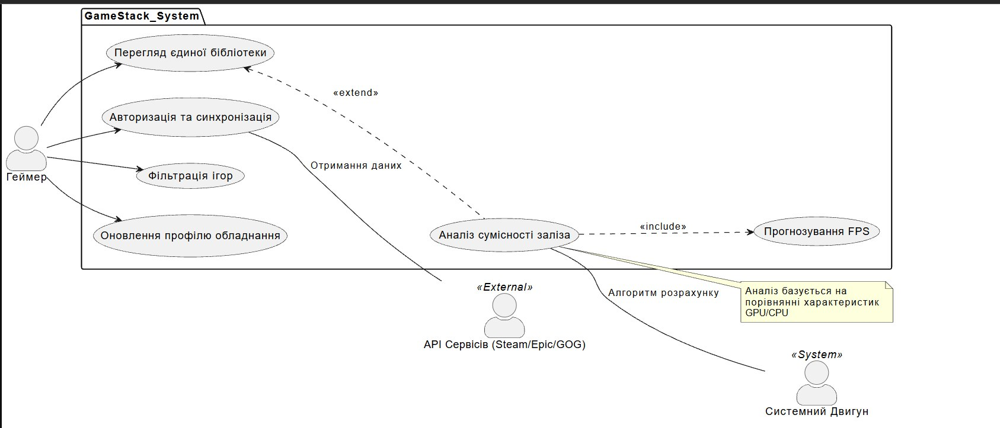
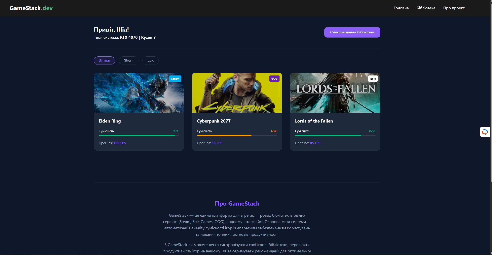

## Тема, Мета, Місце розташування

**Тема:** Розробка адаптивного веб-застосунку «GameStack» для агрегації ігрових бібліотек та аналізу сумісності з апаратним забезпеченням.

**Мета:** На основі досвіду розроблення адаптивних інтерфейсів створити платформу для геймерів, що дозволяє переглядати ігри з різних сервісів (Steam, Epic, GOG) та отримувати прогнози продуктивності (FPS) залежно від заліза користувача.

**Місце розташування:**

- **GitHub:** [https://github.com/3POSENJOYER/IA-34_appRECORD-YereskoIllia-FIOT-2026-Public](https://github.com/3POSENJOYER/IA-34_appRECORD-YereskoIllia-FIOT-2026-Public)
- **Live demo:** [встав посилання на Vercel/Netlify]

---

## Опис предметного середовища

### Функціональні вимоги (Functional Requirements)

- **FR-1:** Агрегація ігрових даних з декількох джерел (Steam, Epic Games Store, GOG).
- **FR-2:** Аналіз сумісності вимог гри із залізом користувача (CPU, GPU, RAM).
- **FR-3:** Прогнозування FPS на основі алгоритму порівняння потужності.
- **FR-4:** Система фільтрації за назвою та платформою.
- **FR-5:** Візуалізація метрик через прогрес-бари зі зміною кольору.
- **FR-6:** Деталізація заліза поточного користувача на головній панелі.

### Нефункціональні вимоги (Non-Functional Requirements)

- **NFR-1:** Дизайн у стилі Gaming UI (темна тема, неонові акценти).
- **NFR-2:** Адаптивність (Desktop 1200px+, Tablet 768px+, Mobile &lt; 768px).
- **NFR-3:** Продуктивність: час ініціалізації додатку до 1.0 сек.
- **NFR-4:** Плавні CSS-анімації (transition, hover effects).
- **NFR-5:** Масштабованість для додавання нових платформ (Ubisoft, Battle.net).
- **NFR-6:** Доступність: використання семантичних HTML-тегів (`<article>`, `<nav>`, `<header>`) та відносних одиниць (`rem`, `em`, `%`).

---

## Хід виконання

### Крок 1. Налаштування проекту

Проект  базується на **SvelteKit** та використовує **pnpm** як менеджер пакетів.

````bash
pnpm install
pnpm dev
## Хід виконання

### Крок 1. Налаштування проекту та запуск
Проект базується на SvelteKit та використовує pnpm як менеджер пакетів. Встановлюємо залежності та запускаємо сервер розробки.

```bash
pnpm install
pnpm dev
Крок 2. Реалізація моделі даних та типів
Для типізації контенту звітів (Markdown з метаданими) використовується TypeScript. Це забезпечує безпеку при роботі з атрибутами файлів.
```markdown
```typescript
TypeScript
export type LabReport = {
  title: string;
  date: string;
  slug: string;
  content: string;
  category?: string;
};
### Крок 3. Створення адаптивного інтерфейсу
Використання компонентного підходу Svelte для створення LabView.svelte та налаштування адаптивної сітки в app.css.

CSS
/* src/app.css */
```markdown
```css
.main-layout {
  display: grid;
  grid-template-columns: 250px 1fr; /* Sidebar + Content */
}

@media (max-width: 768px) {
  .main-layout {
    grid-template-columns: 1fr; /* Стек на мобільних */
  }
}

---

## Діаграми

### UML Use-case діаграма



### ER-діаграма


---

## 1. Структура сторінки index.html (Головна)

<script setup lang="ts">
import { ref } from "vue";
import type { Game } from "./types/game";
import GameCard from "./components/GameCard.vue";
import TheHeader from "./components/TheHeader.vue";
import TheFooter from "./components/TheFooter.vue";

const games = ref<Game[]>([
  {
    id: "1",
    title: "Elden Ring",
    platform: "Steam",
    performanceScore: 95,
    expectedFps: 120,
    cover: "../",
  },
  {
    id: "2",
    title: "Cyberpunk 2077",
    platform: "GOG",
    performanceScore: 68,
    expectedFps: 55,
    cover: "https://images.unsplash.com/photo-1605898393849-4164b38d7f7a?w=400",
  },
  {
    id: "3",
    title: "Lords of the Fallen",
    platform: "Epic",
    performanceScore: 82,
    expectedFps: 85,
    cover: "https://images.unsplash.com/photo-1542751371-adc38448a05e?w=400",
  },
]);
</script>

<template>
  <div class="gamestack-app">
    <TheHeader />

    <main class="container">
      <section id="home" class="hw-summary">
        <div class="user-info">
          <h2>Привіт, Illia!</h2>
          <p>Твоя система: <strong>RTX 4070 | Ryzen 7 </strong></p>
        </div>
        <button class="sync-btn">Синхронізувати бібліотеки</button>
      </section>

      <section id="library" class="library-section">
        <div class="filters">
          <button class="active">Всі ігри</button>
          <button>Steam</button>
          <button>Epic</button>
        </div>

        <div class="game-grid">
          <GameCard v-for="game in games" :key="game.id" :game="game" />
        </div>
      </section>

      <section id="about" class="about-section">
        <h2>Про GameStack</h2>
        <p>
          GameStack — це єдина платформа для агрегації ігрових бібліотек із
          різних сервісів (Steam, Epic Games, GOG) в одному інтерфейсі. Основна
          мета системи — автоматизація аналізу сумісності ігор із апаратним
          забезпеченням користувача та надання точних прогнозів продуктивності.
        </p>
        <p>
          З GameStack ви можете легко синхронізувати свої ігрові бібліотеки,
          перевіряти продуктивність ігор на вашому ПК та отримувати рекомендації
          для оптимальної гри.
        </p>
      </section>
    </main>

    <TheFooter />
  </div>
</template>

<style lang="scss">
@use "./styles/main.scss" as *;

.gamestack-app {
  background-color: $bg-dark;
  color: $text-main;
  min-height: 100vh;
}

.hw-summary {
  display: flex;
  justify-content: space-between;
  align-items: center;
  padding: 2rem 0;
  border-bottom: 1px solid rgba($white, 0.05);
  margin-bottom: 2rem;

  .sync-btn {
    background: $primary;
    border: none;
    padding: 0.8rem 1.5rem;
    border-radius: $border-radius;
    color: white;
    font-weight: bold;
    cursor: pointer;
    &:hover {
      background: lighten($primary, 10%);
    }
  }
}

.game-grid {
  display: grid;
  grid-template-columns: repeat(auto-fill, minmax(280px, 1fr));
  gap: 2rem;
  padding-bottom: 4rem;
}

.about-section {
  padding: 4rem 0;
  text-align: center;
  border-top: 1px solid rgba($white, 0.05);
  margin-top: 4rem;

  h2 {
    color: $primary;
    margin-bottom: 1rem;
  }

  p {
    max-width: 600px;
    margin: 0 auto 1rem;
    color: $text-muted;
  }
}

.filters {
  display: flex;
  gap: 1rem;
  margin-bottom: 2rem;
  button {
    background: transparent;
    border: 1px solid rgba($white, 0.1);
    color: $text-muted;
    padding: 0.5rem 1.2rem;
    border-radius: 20px;
    cursor: pointer;
    &.active {
      background: rgba($primary, 0.1);
      border-color: $primary;
      color: $primary;
    }
  }
}

@media (max-width: $tablet) {
  .hw-summary {
    flex-direction: column;
    text-align: center;
    gap: 1.5rem;
  }
  .filters {
    overflow-x: auto;
    padding-bottom: 10px;
  }
}
</style>
---
```

## Скріншоти

---

## Висновки

У ході  лабораторної роботи було розроблено інформаційну систему «GameStack». Вдалося успішно поєднати бізнес-вимоги до ігрової платформи з технічними засобами Vue 3 та Sass. Використання адаптивних технологій (Grid, Media Queries) забезпечило коректне відображення складної графічної інформації про продуктивність ігор на будь-яких пристроях. Моделювання за допомогою Mermaid дозволило чітко візуалізувати архітектуру даних та сценарії користувацької взаємодії.

